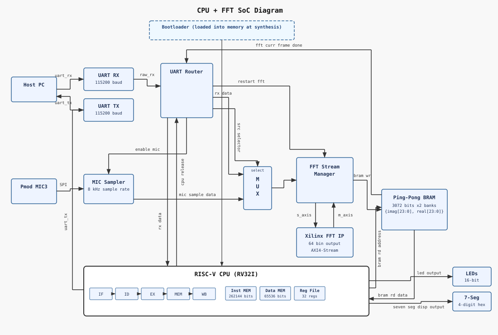
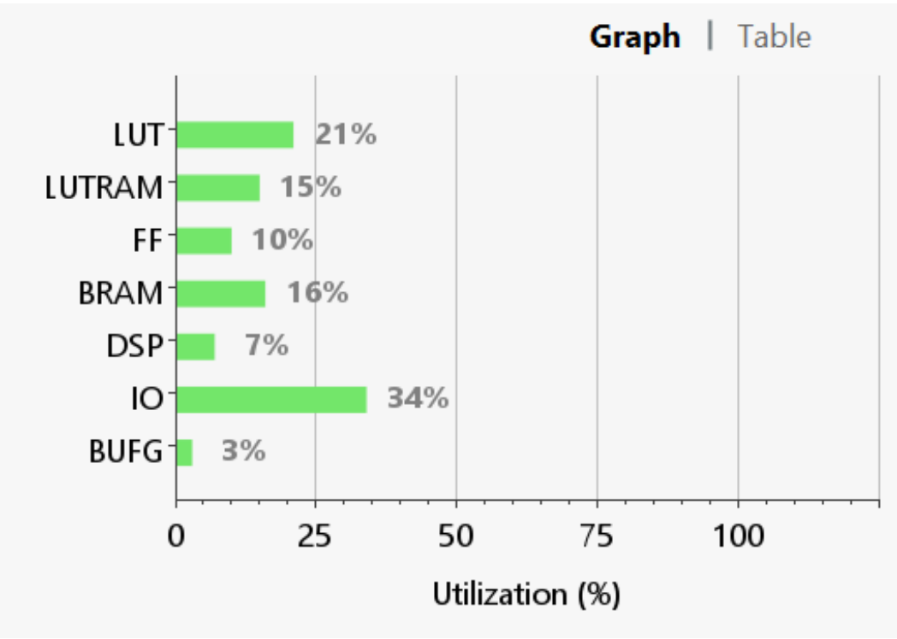

# RISC-V + FFT FPGA SoC

Developed April 2026, uploaded September 2026 for portfolio.

This project implements a custom System-on-Chip on the Basys 3 FPGA for real-time audio frequency analysis. A 5-stage pipelined RV32I processor manages peripherals and data routing through memory-mapped I/O, while a Xilinx FFT IP core performs hardware-accelerated 64-point FFTs. Audio can be streamed from a host PC over UART or sampled from a Pmod MIC3, with FFT results stored in ping-pong BRAM so the CPU can read one frame while the next is being processed.

The software side includes a lightweight C bootloader that receives RV32I programs over UART, writes them into instruction memory through MMIO, and transfers execution to the uploaded program. C firmware also uses MMIO to control peripherals and routing and to read FFT results back from BRAM. The final design achieved a 1.94 µs FFT computation time and approximately 6.94 µs from the final input sample through completion of the CPU readback. The estimated total on-chip power consumption was 0.223 W.

